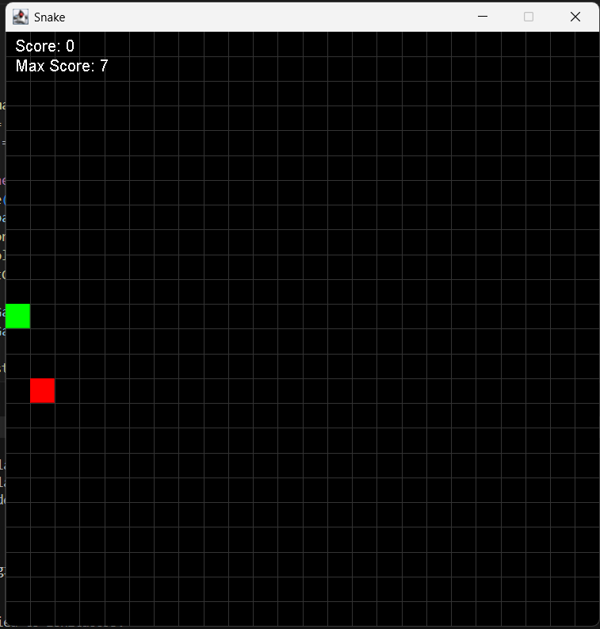
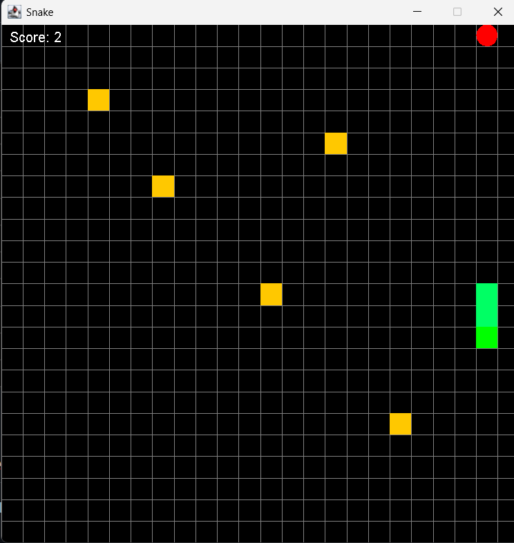
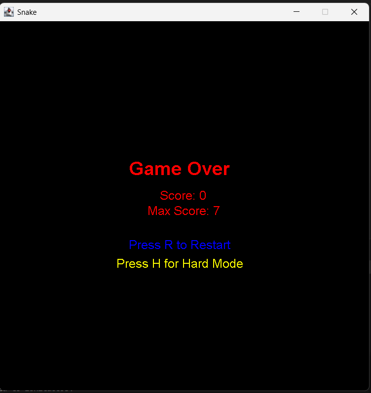

## 🐍 Java Snake Game

A classic Snake Game built using Java Swing with two difficulty modes: **Easy** and **Hard**. This project demonstrates object-oriented design, GUI programming with Swing, and basic file handling for high score tracking.

---

## 🚀 Features

- 🎮 Two Modes:
  - **Easy Mode** – Beginner-friendly, no obstacles
  - **Hard Mode** – Includes obstacles and move history tracking
- 📈 Score and High Score tracking
- 🔄 Switch between modes from Game Over screen
- 💾 High Score saved using `highscore.txt`
- ⌨️ Keyboard Controls for movement and actions
- 🧠 Last 5 Moves tracking in Hard Mode
- 🖼️ Grid-based game board using `Graphics`

---

## 📂 Project Structure
snakeproject/
├── App.java # Main launcher
├── SnakeGame.java # Easy mode implementation
├── HardMode.java # Hard mode with obstacles
├── MaxScoreManager.java # High score file handler
├── highscore.txt # Stores the max score

---

## 🎮 Controls

| Key         | Action                         |
|------------|---------------------------------|
| `ENTER`    | Start game (in Easy Mode)       |
| `↑ ↓ ← →`  | Move the snake                 |
| `R`        | Restart after game over         |
| `H`        | Switch to Hard Mode (from Easy) |
| `E`        | Switch to Easy Mode (from Hard) |
| `P`        | Show last 5 moves (Hard Mode)   |

---

## 🛠 How to Run

### ✅ Requirements
- Java JDK 8 or above installed
- Command Line or Java IDE (VS Code / IntelliJ)

### 🔃 Compile & Run

Open terminal and navigate to the project directory:
cd path/to/snakeproject
javac *.java
java App

### ▶️ Run in VS Code or IntelliJ
Open the folder in your IDE.

Make sure all .java files are in the same package or default folder.

Right-click App.java → Run.

## 💾 High Score Tracking
High score is saved in a local file highscore.txt.

Automatically updated if a new high score is achieved.

## 📸 Screenshots
Easy Mode	

Hard Mode

Game Over!!

## 🙌 Acknowledgements
This project is inspired by the classic Snake game concept and built using core Java features. It’s great for learning:

OOP

GUI programming

Game loops

File handling

✨ Author
Made with ❤️ by Ishita
